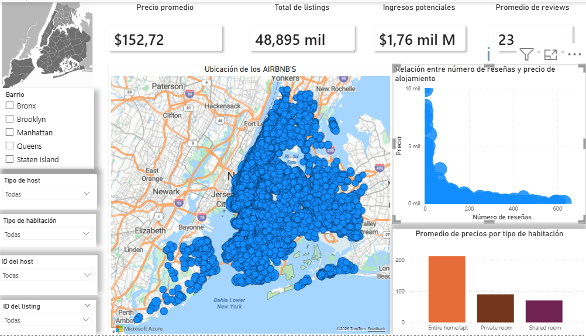

# 📊 Fase 5: Dashboard Ejecutivo en Power BI

## 🧱 Modelado de Datos

Se creó una tabla adicional para identificar y clasificar los anfitriones:

```DAX
Hosts = 
ADDCOLUMNS(
    SUMMARIZE(
        NY_AIRBNB,
        NY_AIRBNB[host_id],
        NY_AIRBNB[host_name]
    ),
    "Listings_Count", CALCULATE(COUNT(NY_AIRBNB[id])),
    "Type", 
        IF(
            CALCULATE(COUNT(NY_AIRBNB[id])) = 1,
            "Ocassional",
            "Professional"
        )
)
```


Propósito:
--Obtener un registro de hosts únicos
--Clasificarlos según su nivel de actividad:
--Occasional: 1 listing
--Professional: 2 o más listings
--Relación:Se estableció una relación 1 a muchos entre la tabla Hosts y la tabla NY_AIRBNB.

### Métricas principales (Tarjetas)

El dashboard incluye las siguientes métricas clave:

-Precio promedio
-Total de listings
-Promedio de reseñas
-Ingreso potencial (medida DAX):

```DAX
Ingreso_Potencial = 
SUMX(
    NY_AIRBNB, 
    NY_AIRBNB[price] * (365 - NY_AIRBNB[availability_365])
)
```

### Filtros (Interactividad)

Se incorporaron filtros para facilitar el análisis dinámico:

-Barrio (neighbourhood)
-Tipo de host (Occasional / Professional)
-Tipo de habitación (room_type)
-ID del host
-ID del listing

### Visualizaciones
 Mapa
-Representa la ubicación geográfica de los listings
-Permite identificar zonas con mayor concentración de oferta


 Gráfico de dispersión
Eje X: número de reseñas (number_of_reviews)
Eje Y: precio (price)

Objetivo:
Analizar la relación entre precio y demanda.

Gráfico de barras
Eje: tipo de habitación (room_type)
Valor: precio promedio

Objetivo:
Comparar cómo el tipo de alojamiento influye en el precio.


Imagen del informe
